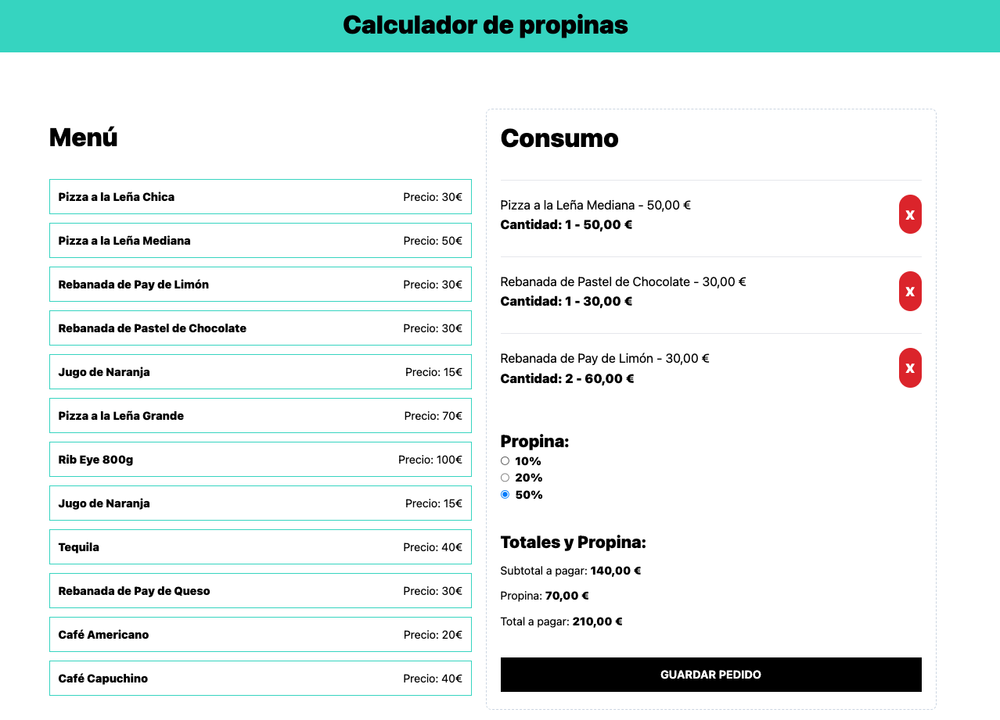

# TipCalculator - React & customHooks

## Descripción
Este proyecto es una aplicación que permite calcular la propina de una lista de productos de un bar, desarrollado con **React**. Durante su desarrollo, he aprendido a utilizar **TailwindCSS** para el diseño, afianzando conceptos de los hooks más utilizados en React y creando mi propio **custom hook**. También he comprendido la importancia de **useMemo** para optimizar cálculos dependientes de ciertas variables.

## Tecnologías utilizadas
- **React**: Biblioteca principal para la construcción de la interfaz.
- **TailwindCSS**: Para el diseño y estilizado rápido y eficiente.
- **useMemo**: Para la optimización del rendimiento en cálculos dependientes de valores específicos.
- **Custom Hooks**: Para encapsular lógica reutilizable y mejorar la organización del código.
- **Vite**: Para la configuración y optimización del entorno de desarrollo.

## Lecciones aprendidas
1. **Uso de TailwindCSS**:
   - Permite estilizar rápidamente los componentes sin necesidad de archivos CSS adicionales.
   - Facilita la creación de diseños responsivos de forma sencilla.
   
2. **Profundización en hooks de React**:
   - Uso de **useMemo** para mejorar el rendimiento de la aplicación.
   - Creación de **custom hooks** para encapsular lógica reutilizable.
   
3. **Primeros pasos sólidos en React**:
   - Comenzar a comprender el potencial de React en la creación de interfaces dinámicas y eficientes.
   - Aprender a manejar mejor el estado y la reactividad de los componentes.

## Deploy
Puedes ver la aplicación funcionando en el siguiente enlace:  
🔗 [TipCalculator Deploy](https://juli-tip-calculator.netlify.app)

